# Population Models

This repo contains the scripts to simulate a population model of 3 species with 3 different methods:

1. Using a deterministic ODE solver
2. Using an stochastic method (Gillespie Algorithm)
3. Using a agent based approach

For the first two options the ODE system is: 

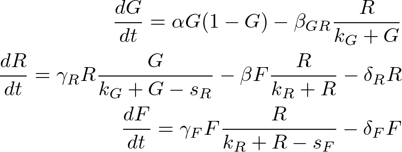

The system models a food chain as follows: 

*The food chain begins with the plant. The plant is eaten by the rabbit. The rabbit is then eaten by a larger animal, the fox.*

Being **G** the amount of *grass*, **R** the number of *rabbits*, and **F** the number of *foxes*. The deltas are the death rates of each specie according to their subindex....

The algorith for the Cellular Automata (C.A.) is as follows:

> **FOR** T steps
>> **FOR** *j* individuals in the population list *P*
>>> choose a random neighbor *i*

>>> **IF** *j*=prey and *i*=empty
>>>> *j* reproduce with probability *r*

>>> **ELSEIF** *j*=predator 1 and *i*=empty
>>>> *j* move with probability *m_r*

>>> **ELSEIF** *j*=predator 1 and *i*=prey
>>>> *j* eats *i* with probability *e_r* and *i* becomes of the type *j*

>>> **ELSEIF** *j*=predator 1 and *i*=predator 2
>>>> *j* dies with probability *d_r*

>>> **ELSEIF** *j*=predator 2 and *i*=empty
>>>> *j* move with probability *m_f*

>>> **ELSEIF** *j*=predator 2 and *i*=predator 1
>>>> *j* eats $i$ with probability *e_f* and *i* becomes of the type *j*

>>> **ELSEIF** *j*=predator 2 and *i*=predator 2
>>>> *j* dies with probability *d_f*

>>**ENDFOR**

>**ENDFOR**

## 1. Determinisit Results

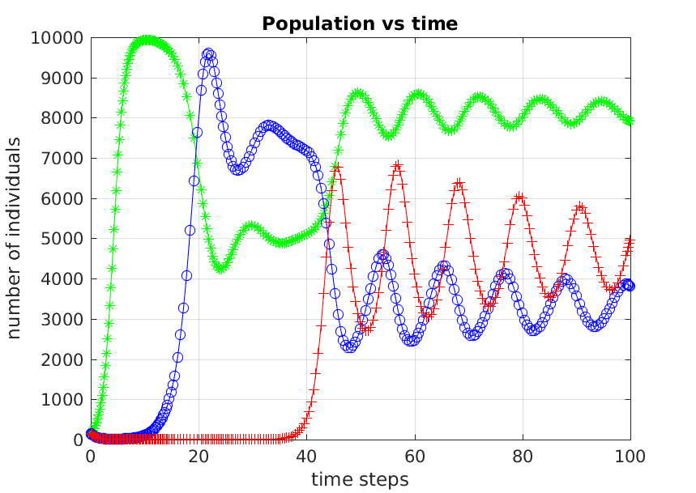
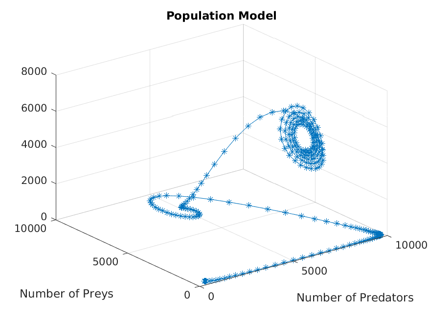

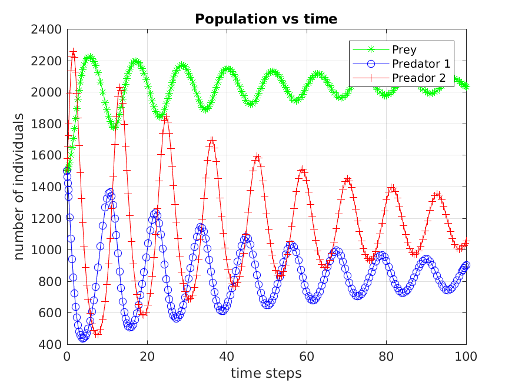
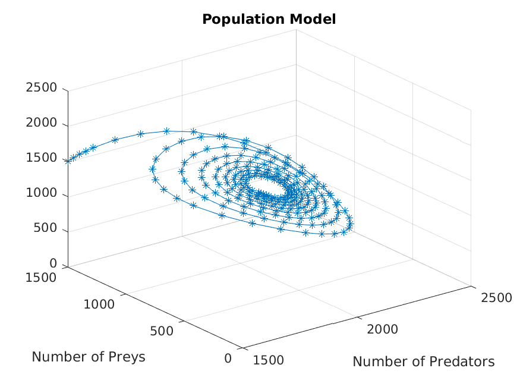

## 2. Stochastic Results

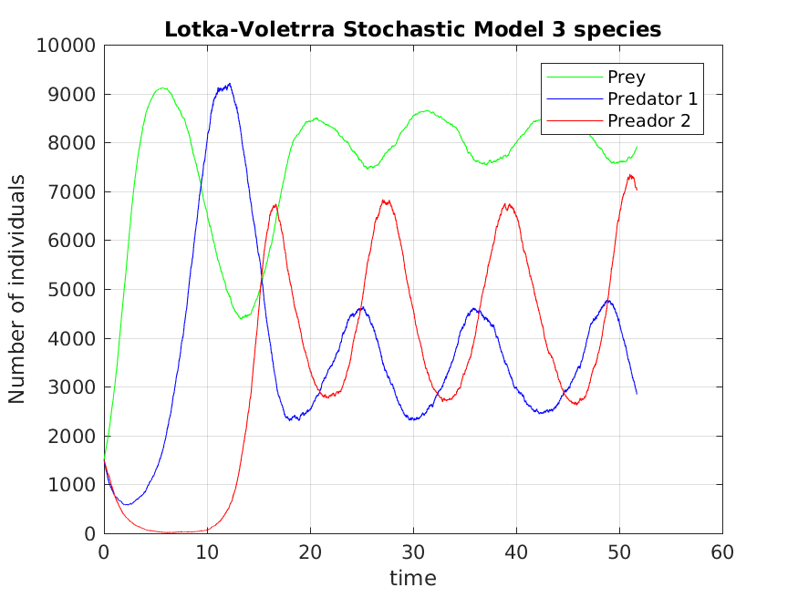
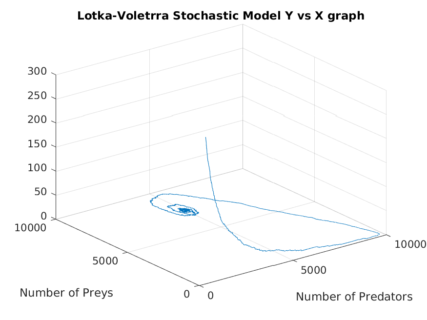

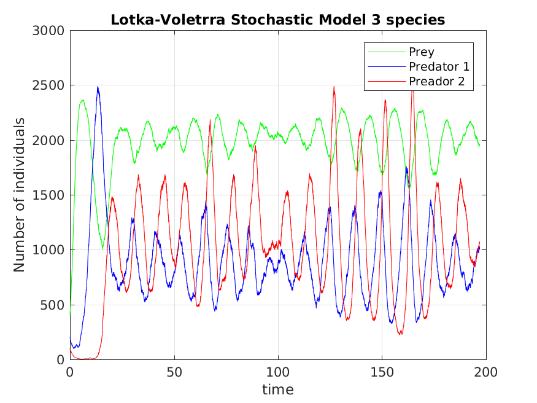
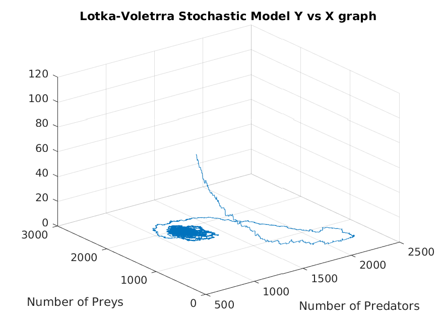

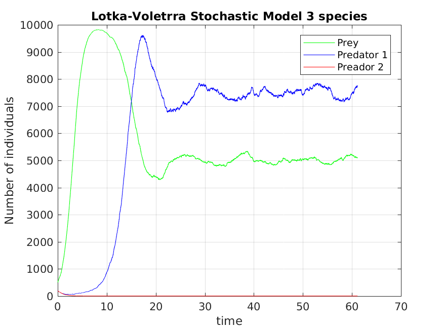
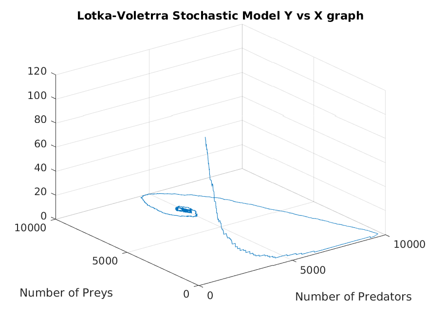

## 3. C.A. Results 

