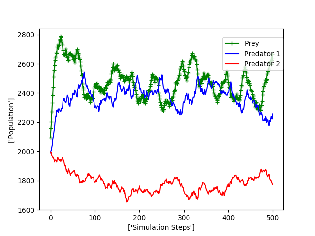
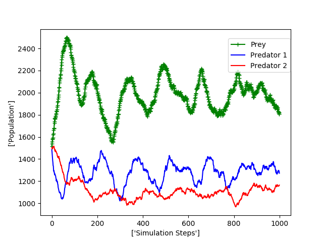
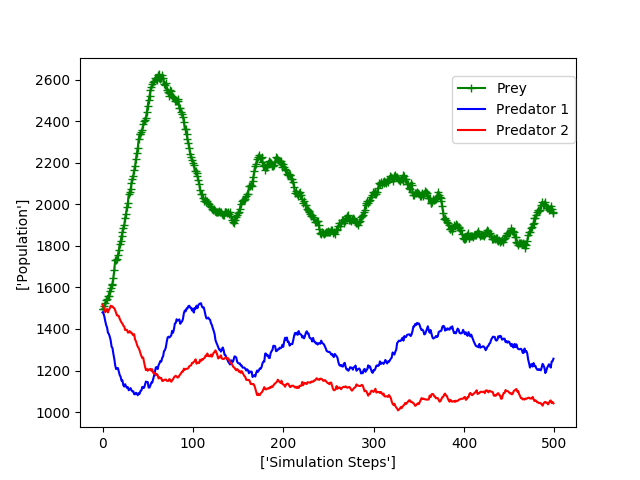
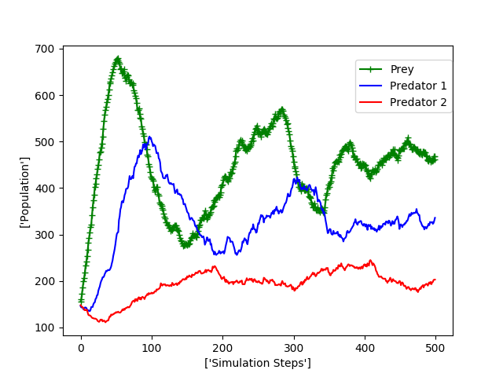
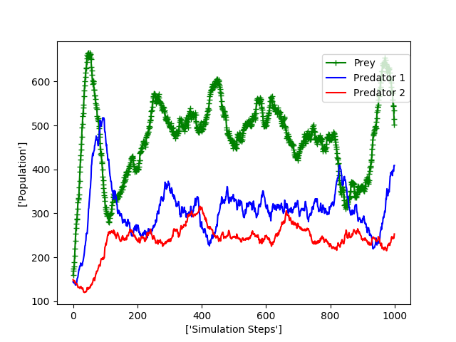

# Population Models

This repo contains the scripts to simulate a population model of 3 species with 3 different methods:

1. Using a deterministic ODE solver
2. Using an stochastic method (Gillespie Algorithm)
3. Using a agent based approach


### System model 

The ODE system is: 


The system models a food chain as follows: 

*The food chain begins with the plant. The plant is eaten by the rabbit. The rabbit is then eaten by a larger animal, the fox.*

Being **G** the amount of *grass*, **R** the number of *rabbits*, and **F** the number of *foxes*. The deltas are the death rates of each specie according to their subindex....

### Cellular Automata

The algorith for the Cellular Automata (C.A.) is as follows:

> **FOR** T steps
>> **FOR** *j* individuals in the population list *P*
>>> choose a random neighbor *i*

>>> **IF** *j*=prey and *i*=empty
>>>> *j* reproduce with probability *r*

>>> **ELSEIF** *j*=predator 1 and *i*=empty
>>>> *j* move with probability *m_r*

>>> **ELSEIF** *j*=predator 1 and *i*=prey
>>>> *j* eats *i* with probability *e_r* and *i* becomes of the type *j*

>>> **ELSEIF** *j*=predator 1 and *i*=predator 2
>>>> *j* dies with probability *d_r*

>>> **ELSEIF** *j*=predator 2 and *i*=empty
>>>> *j* move with probability *m_f*

>>> **ELSEIF** *j*=predator 2 and *i*=predator 1
>>>> *j* eats $i$ with probability *e_f* and *i* becomes of the type *j*

>>> **ELSEIF** *j*=predator 2 and *i*=predator 2
>>>> *j* dies with probability *d_f*

>>**ENDFOR**

>**ENDFOR**

The scripts are organized in the next way:
`prey_pred_2.m` contains the ODE system stated above. 
`Model_Lotka_analytic.m` solves the model using a ode45 solver. 
`lotca_stochastic_3species.m` solves the Lotka-Volterra model using Gillespie Algorithm,
The simulation depends on the parameters  *size*, *alpha*, *beta_gr*, *beta_r*, *gamma_r*, *gamma_f*, *delta_r*, *delta_f*, *k_g*, *k_r*, *s_f* and  *s_r* as stated in the equation system, and the initial populations: **g0**, **r0** and **f0** which can be changed in the files `Model_Lotka_analytic.m` and `lotca_stochastic_3species.m`. 

`2species_CA.py`will simulate the system as a Cellular Automata as stated above. It will create a file with 4 columns indicating 

| Simulation Step| Population G | Population F  | Population R |
| -------------  |:------------:| -------------:| ------------:|

The initial populations can be changed in the lines 

```python
spec1_i=XXX #grass
spec2_i=XXX #rabbit
spec3_i=XXX #foxes
```
If there are several simulations which were run under the same conditions you can plot all of them in a single graph by using `plot_data.m` you just need to change the line 
```matlab
name='results/XXXXXX_';
```
being XXXXX the base name of the simulatons you want to plot


If you want to change the ODE system to your own you can do it by modifying the fifle `prey_pred_2.m`

## 1. Determinisit Results


## 2. Stochastic Results


## 3. C.A. Results 






